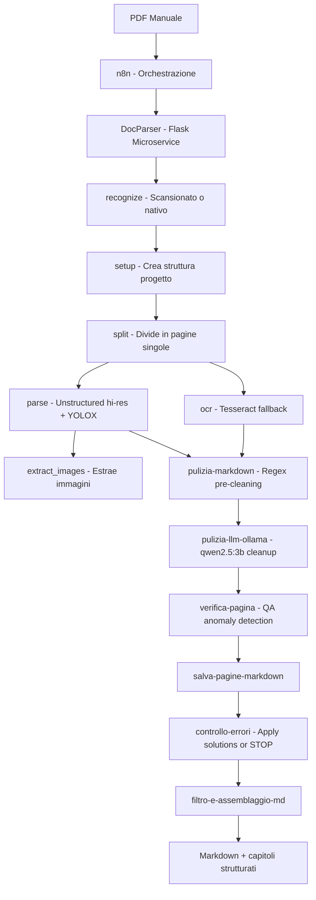

# 🐉 Dungeons & Byte

A self-hosted pipeline to digitize and index tabletop RPG manuals.
Transforms PDF documents into structured Markdown, ready for RAG ingestion or full-text search.

## What it does

- Detects whether a PDF is native or scanned
- Splits PDFs into single pages for parallel processing
- Extracts text using Unstructured.io (hi-res, YOLOX layout model)
- Falls back to Tesseract OCR for scanned pages
- Extracts and crops images with coordinate mapping
- Cleans OCR output with regex pre-processing + LLM post-processing (qwen2.5:3b via Ollama)
- Detects and logs OCR anomalies (table garbage, wrong language) to a QA file
- Applies manual corrections from `qa/solutions.json` before final assembly
- Creates a structured project folder for each manual

## Architecture



## Stack

Python · Flask · PyMuPDF · Unstructured.io · Tesseract · n8n · Ollama (qwen2.5:3b)

## Project folder structure

```
/shared/projects/
├── pool/                        # PDF sources (input queue)
├── qa/
│   ├── solutions.json           # Global corrections applied cross-project
│   └── errors/
│       └── <project-name>.json  # Per-run anomaly log
└── <Project Title>/
    ├── images/                  # Extracted images
    ├── json/                    # Intermediate JSON from docparser
    ├── markdown/                # Per-page cleaned markdown (page_N.md)
    ├── pages/                   # Single-page PDFs
    └── <Project Title>.md       # Final assembled markdown
```

## QA / Correction workflow

After each run, `qa/errors/<project>.json` contains detected anomalies:

```json
[
  {
    "page": 50,
    "type": "table_garbage",
    "context": "Blocca persone | Ammaliamento",
    "column_index": 2,
    "found": "O00rP00ì0)ìz£0 010"
  }
]
```

To fix: add entries to `qa/solutions.json` and re-run the workflow.
The `controllo-errori` node applies corrections before assembly:

```json
[
  { "wrong": "O00rP00ì0)ìz£0 010", "correct": "C" }
]
```

Solutions accumulate across runs — once added, they apply to all future projects automatically.

## DocParser endpoints

| Endpoint | Method | Description |
|---|---|---|
| `/parse_from_path` | POST | Unstructured hi-res PDF parsing (YOLOX) |
| `/ocr_from_path` | POST | Tesseract OCR fallback |
| `/split` | POST | Split PDF into single pages |
| `/setup` | POST | Create project folder structure |
| `/recognize` | POST | Detect if PDF is native or scanned |
| `/extract_images_from_path` | POST | Extract embedded images |
| `/render_page` | POST | Render scanned page as PNG |
| `/crop` | POST | Crop image regions by bounding box |
| `/split_markdown` | POST | Split markdown into chunks for RAG |
| `/correct_markdown` | POST | LLM-based markdown correction (legacy, requires LiteLLM) |
| `/dots_mocr` | POST | dots.mocr OCR via subprocess |

## n8n workflow

The orchestration workflow is exported at `n8n/Dungeons_and_Byte.workflow.json`.
Import it directly into n8n via Settings → Import Workflow.

**After import, update these placeholders in the node HTTP request URLs:**

| Placeholder | Description |
|---|---|
| `DOCPARSER_HOST` | IP or hostname of the DocParser container (port 5000) |
| `OLLAMA_HOST` | IP or hostname of the Ollama container (port 11434) |

## Environment variables (DocParser)

| Variable | Default | Description |
|---|---|---|
| `DOCPARSER_BASE_PATH` | `/shared/projects` | Base path for project folders |
| `LITELLM_URL` | `http://localhost:4000/v1/chat/completions` | LiteLLM endpoint (correct_markdown) |
| `LITELLM_API_KEY` | *(required)* | API key for LiteLLM |
| `DOTS_MOCR_PYTHON` | `/opt/docparser/bin/python` | Python binary for dots.mocr |
| `DOTS_MOCR_SCRIPT` | `/opt/dots.ocr/run_inference.py` | Inference script path |

## Status

🚧 Work in progress — part of a larger homelab AI project.

## Notes

Deployed on LXC containers (Proxmox). GPU: NVIDIA T1000 8GB.
