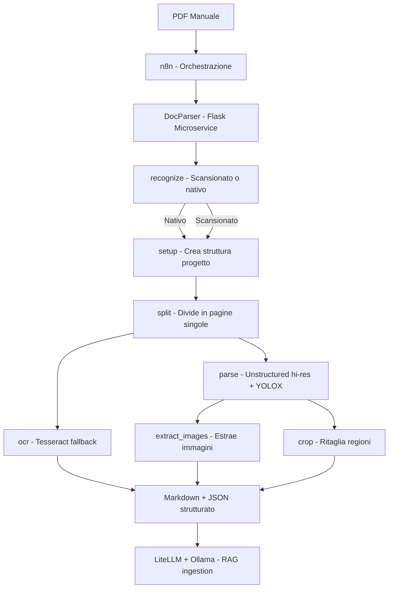

# 🐉 Dungeons & Byte

A self-hosted pipeline to digitize and index tabletop RPG manuals.
Transforms PDF documents into structured Markdown and JSON,
ready for RAG ingestion or full-text search.

## What it does

- Detects whether a PDF is native or scanned
- Splits PDFs into single pages for parallel processing
- Extracts text using Unstructured.io (hi-res, YOLOX layout model)
- Falls back to Tesseract OCR for scanned pages
- Extracts and crops images with coordinate mapping
- Creates a structured project folder for each manual

## Architecture

## Stack

Python · Flask · PyMuPDF · Unstructured.io · Tesseract · n8n · LiteLLM · Ollama

## Status

🚧 Work in progress — part of a larger homelab AI project.

## Notes

Deployed on LXC container (Proxmox). Base paths configurable
via environment variable `DOCPARSER_BASE_PATH`.
