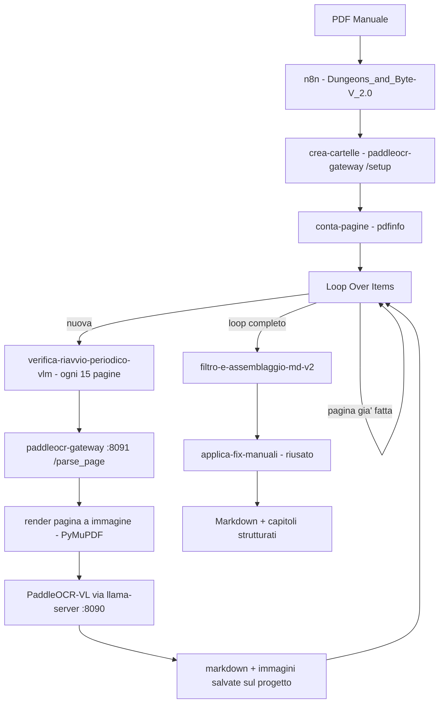
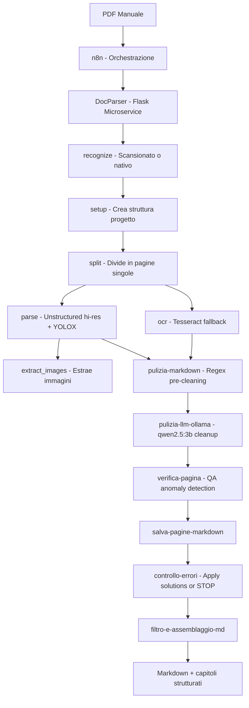

# 🐉 Dungeons & Byte

A self-hosted pipeline to digitize and index tabletop RPG manuals.
Transforms PDF documents into structured Markdown, ready for RAG ingestion or full-text search.

## What it does

- Detects whether a PDF is native or scanned
- Splits PDFs into single pages for parallel processing
- Extracts text using Unstructured.io (hi-res, YOLOX layout model)
- Falls back to Tesseract OCR for scanned pages
- Extracts and crops images with coordinate mapping
- Cleans OCR output with regex pre-processing + LLM post-processing (qwen2.5:3b via Ollama)
- Detects and logs OCR anomalies (table garbage, wrong language) to a QA file
- Applies manual corrections from `qa/solutions.json` before final assembly
- Creates a structured project folder for each manual

## v2.0 — Single-pipeline architecture (PaddleOCR-VL)

The v1.x architecture (below) grew a hard fork between native and scanned PDFs
(different engines, different bugs, different fixes) plus ~20 accumulated
one-off heuristics in `manifest_engine.py`/`parse.py` for edge cases found
one book at a time (decorative garbage headings, monster stat blocks read as
titles, TOC dot-leaders, page numbers read as headings, running headers,
font-glyph ambiguity, h2 calibration per book, ...). Every fix reduced one
symptom without touching the underlying issue: font-size/geometry heuristics
were being asked to make judgment calls that require actual semantic
understanding of the page.

v2.0 replaces the whole native/scan split and the heuristic pile with a
**single self-hosted vision-language model** ([PaddleOCR-VL-1.6](https://huggingface.co/PaddlePaddle/PaddleOCR-VL-1.6),
~0.9B params) that does layout detection + OCR + table/structure recognition
in one pass, always working from the rendered page **image** — so native and
scanned PDFs go through the identical code path. Kept intentionally simple
(KISS): one model, one gateway, one n8n loop, no per-book special cases.



**Deliberately kept local, not cloud.** A cloud LLM (tested with
`groq/llama-3.3-70b-versatile`) produced excellent results, but the free-tier
throughput (~30-40 pages/day) and the ongoing per-token cost were rejected in
favor of staying fully self-hosted. That choice had a real engineering cost:

- **Memory leak in `llama-server`**: not just an oversized initial allocation
  (fixed with `--parallel 1 --ctx-size 16384`, same fix already used for
  Surya) but genuine growth *during* use (~700MB clean → 5-7GB after a few
  hundred pages), enough to push the whole Proxmox host into swap thrashing.
  Mitigated with an unconditional restart every 15 pages
  (`verifica-riavvio-periodico-vlm`, fire-and-forget), same pattern already
  proven for Surya's own leak.
- **Deterministic decoding dead-end**: a rare, page-specific error
  (`"model produced output that does not match the expected peg-native
  format"`) where the model's constrained-grammar output gets stuck at
  `temperature=0`, more likely on pages with long continuous text blocks
  (dense multi-column pages). Mitigated with tiered retries at increasing
  temperature (`0 → 0.3 → 0.6 → 0.9`) — improves the odds but is
  probabilistic, not guaranteed; if all tiers fail the request errors out and
  the n8n execution stops (by design — a failed page should be visible, not
  silently skipped).
- **GPU contention**: the T1000 8GB is shared with other containers
  (Ollama, and formerly dots.ocr on the same box). The old
  `dots-ocr.service`/`ocr-gateway.service` grabbed the GPU ahead of the VLM
  at container boot twice before being removed entirely — the container
  (renamed `paddleocr-vl`, ex `dots-ocr`) is now dedicated to this pipeline
  only.

**Fully self-contained**: v2.0 no longer depends on the v1.x `DocParser`
service at all — the one endpoint it still used (`/setup`, project folder
creation) was reimplemented directly in the gateway (`paddleocr-vl/`), so
the whole pipeline now runs off a single container plus n8n for
orchestration.

**Known limitations, not yet solved:**
- Pages with a complex map+box layout (several room-description boxes
  scattered around a dungeon map) can still mix text from different rooms —
  the exact case that originally motivated adding Surya to v1.3. Better than
  the old fixed 2-column geometric split, but not fully solved.
- During a high-temperature retry, a monster/NPC stat block can occasionally
  be misclassified as a chapter heading instead of staying as body text
  (found once across 15 books) — same failure class the v1.x
  `_is_monster_statblock_title` heuristic targeted, not yet re-added here
  since it's rare enough to fix manually via `manual_fixes.json` if it
  recurs.

**Validated on 15 manuals** — a mix of native and scanned PDFs, spanning
original publication years from the early 1980s to 2024, ranging from
short single-session adventures to 400+ page core rulebooks.

Code: [`paddleocr-vl/`](./paddleocr-vl) (gateway + systemd units). Workflow:
[`n8n/Dungeons_and_Byte-V_2.0.workflow.json`](./n8n/Dungeons_and_Byte-V_2.0.workflow.json).

---

## v1.x Architecture (legacy)



## Stack

Python · Flask · PyMuPDF · Unstructured.io · Tesseract · n8n · Ollama (qwen2.5:3b)

## Project folder structure

```
/shared/projects/
├── pool/                        # PDF sources (input queue)
├── qa/
│   ├── solutions.json           # Global corrections applied cross-project
│   └── errors/
│       └── <project-name>.json  # Per-run anomaly log
└── <Project Title>/
    ├── images/                  # Extracted images
    ├── json/                    # Intermediate JSON from docparser
    ├── markdown/                # Per-page cleaned markdown (page_N.md)
    ├── pages/                   # Single-page PDFs
    └── <Project Title>.md       # Final assembled markdown
```

## QA / Correction workflow

After each run, `qa/errors/<project>.json` contains detected anomalies:

```json
[
  {
    "page": 50,
    "type": "table_garbage",
    "context": "Blocca persone | Ammaliamento",
    "column_index": 2,
    "found": "O00rP00ì0)ìz£0 010"
  }
]
```

To fix: add entries to `qa/solutions.json` and re-run the workflow.
The `controllo-errori` node applies corrections before assembly:

```json
[
  { "wrong": "O00rP00ì0)ìz£0 010", "correct": "C" }
]
```

Solutions accumulate across runs — once added, they apply to all future projects automatically.

## DocParser endpoints

| Endpoint | Method | Description |
|---|---|---|
| `/parse_from_path` | POST | Unstructured hi-res PDF parsing (YOLOX) |
| `/ocr_from_path` | POST | Tesseract OCR fallback |
| `/split` | POST | Split PDF into single pages |
| `/setup` | POST | Create project folder structure |
| `/recognize` | POST | Detect if PDF is native or scanned |
| `/extract_images_from_path` | POST | Extract embedded images |
| `/render_page` | POST | Render scanned page as PNG |
| `/crop` | POST | Crop image regions by bounding box |
| `/split_markdown` | POST | Split markdown into chunks for RAG |
| `/correct_markdown` | POST | LLM-based markdown correction (legacy, requires LiteLLM) |
| `/dots_mocr` | POST | dots.mocr OCR via subprocess |

## n8n workflow

The current (v2.0) workflow is exported at
`n8n/Dungeons_and_Byte-V_2.0.workflow.json`. Legacy exports (v1.x, native/scan
split) are kept in the same folder for reference. Import directly into n8n
via Settings → Import Workflow.

**After import, update these placeholders in the node HTTP request URLs:**

| Placeholder | Description |
|---|---|
| `DOCPARSER_HOST` | IP or hostname of the DocParser container (port 5000) — v1.x only |
| `OLLAMA_HOST` | IP or hostname of the Ollama container (port 11434) — v1.x only |
| `PADDLEOCR_GATEWAY_HOST` | IP or hostname of the PaddleOCR-VL gateway container (port 8091) — v2.0, all nodes |

## Environment variables (DocParser)

| Variable | Default | Description |
|---|---|---|
| `DOCPARSER_BASE_PATH` | `/shared/projects` | Base path for project folders |
| `LITELLM_URL` | `http://localhost:4000/v1/chat/completions` | LiteLLM endpoint (correct_markdown) |
| `LITELLM_API_KEY` | *(required)* | API key for LiteLLM |
| `DOTS_MOCR_PYTHON` | `/opt/docparser/bin/python` | Python binary for dots.mocr |
| `DOTS_MOCR_SCRIPT` | `/opt/dots.ocr/run_inference.py` | Inference script path |

## Status

🚧 Work in progress — part of a larger homelab AI project.

## Notes

Deployed on LXC containers (Proxmox). GPU: NVIDIA T1000 8GB.
